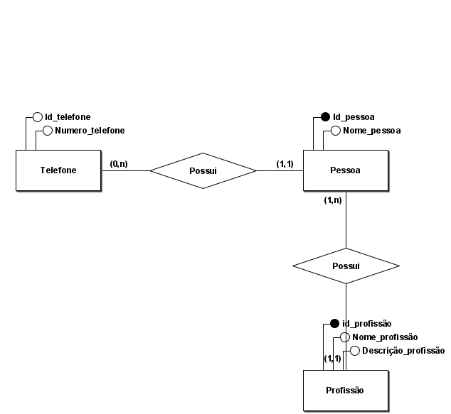

# ExercicioJDBC
Esse é um pequeno projeto de uma aplicação conectada a um banco de dados. Projeto de faculdade criado para a matéria de Técnicas de programação.

 
 

Diagrama do banco de dados: 

 
 

  

